[](openPDC_Home.md "The Open Source Phasor Data Concentrator")

|   |   |   |   |   |
|---|---|---|---|---|
| **[Grid Protection Alliance](http://www.gridprotectionalliance.org "Grid Protection Alliance Home Page")** | **[openPDC Project](https://github.com/GridProtectionAlliance/openPDC "openPDC Project on GitHub")** | **[openPDC Wiki](openPDC_Home.md "openPDC Wiki Home Page")** | **[Documentation](openPDC_Documentation_Home.md "openPDC Documentation Home Page")** | **[Latest Release](https://github.com/GridProtectionAlliance/openPDC/releases "openPDC Releases Home Page")** |

# Getting Started with openPDC

This guide is intended to aid in building the openPDC software and setting it up to start using it. If you're already familiar with the guide, feel free to use this navigation tool to jump around.

-  [Install openPDC with the installers](#install-openpdc-with-the-installers)
-  [Manually set up the database](#manually-set-up-the-database)
    -   [Setting up a SQL Server database](#setting-up-a-sql-server-database)
    -   [Setting up a MySQL database](#setting-up-a-mysql-database)
    -   [Modifying the configuration file](#modifying-the-configuration-file)
    -   [Encrypt the configuration settings](#encrypt-the-configuration-settings)
-   [Running the openPDC](#running-the-openpdc)
-   [Using the openPDC console](#using-the-openpdc-console)
    -   [See the list of commands (the help command)](#see-the-list-of-commands-the-help-command)
    -   [See the list of adapters (the list command)](#see-the-list-of-adapters-the-list-command)
    -   [View performance details about the openPDC service (the health command)](#view-performance-details-about-the-openpdc-service-the-health-command)
    -   [View low level data (the status command)](#view-low-level-data-the-status-command)
    -   [Connect and disconnect a PMU or PDC (the connect and disconnect commands)](#connect-and-disconnect-a-pmu-or-pdc-the-connect-and-disconnect-commands)
-   [Running the PMU Connection Tester](#running-the-pmu-connection-tester)
    -   [Creating and verifying an IEEE C37.118-2005 data stream](#creating-and-verifying-an-ieee-c37118-2005-data-stream)
    -   [Creating and verifying a BPA PDCstream data stream](#creating-and-verifying-a-bpa-pdcstream-data-stream)
-   [Configuring openPDC security](#configuring-openpdc-security)
-   [Using the in-process historian adapter](#using-the-in-process-historian-adapter)
    -   [Metadata Web Service](#metadata-web-service)
    -   [Time-series Web Service](#time-series-web-service)
-   [Configuring a Connection String](#configuring-a-connection-string)
    -   [File](#file)
    -   [TCP](#tcp)
    -   [UDP](#udp)
    -   [Serial](#serial)
-   [Installation directory](#installation-directory)

---

## Install openPDC with the installers

This section goes over how to setup the openPDC and related components using the installers. The first thing you will need to do is download and extract the installers. For this you have two options:

1.  Install from the current release build:
    1.  Go to the [openPDC Latest Release](https://github.com/GridProtectionAlliance/openPDC/releases) and scroll to the  **Downloads** section.
    2.  Click on the [Synchrophasor.Installs.zip](https://github.com/GridProtectionAlliance/openPDC/releases/download/v2.3/Synchrophasor.Installs.zip) to download and extract the installers to a directory of your choice.

2.  An alternative is to install from the [Nightly Builds](Nightly_Builds.md)

    1.  Go to the [Nightly Builds](Nightly_Builds.md) and click on the [**Synchrophasor Installers**](https://www.gridprotectionalliance.org/NightlyBuilds/openPDC/Beta-VS2012/Synchrophasor.Installs.zip) link.
    2.  Download and extract the installers to a directory of your choice.

Once you have extracted the downloaded file, you can install the following programs by running openPDCSetup.exe.

| Program | Installer | Description |
|---|---|---|
| openPDC | openPDCSetup.exe | The main application installed as a Windows service. |
| openPDC Manager   | openPDCSetup.exe | Graphics application used to help configure openPDC |

**[Nightly Builds](Nightly_Builds.md) Installers** - These may vary with each build

| Program | Installer | Description |
|---|---|---|
| openPDC  | openPDCSetup.msi / openPDCSetup64.msi | The main application installed as a Windows service.    |

The web based openPDCManager is not included in openPDCSetup v1.2 and later releases.  For the web based openPDCManager installers refer to the previous openPDC v1.1 release in the Synchrophasors.zip download.  If you are installing the web based openPDC Manager, you will need to change the configuration file as described on the [Frequently Asked Questions](FAQ.md#openpdcmanager_installer) page.

| Web Program | Installers | Description |
|---|---|---|
| openPDC Manager    | openPDCManagerWebSetup.msi / openPDCManagerServicesSetup.msi     | Silverlight application used to help configure openPDC. Needs IIS 4.0 or later to be installed. |

The openPDC installer will automatically launch the database setup utility during the installation. If the database setup utility fails to install your database, your openPDC installation will not fail. You can run the database setup utility again once your installation has finished.

If the database setup utility has successfully installed your database, you can skip ahead to [Running the openPDC](#running-the-openpdc). Otherwise, you will need to run the database setup utility again or go to [Manually set up the database](#manually-set-up-the-database).

The following screen shots show how to perform a basic installation using the sample data available in the database:

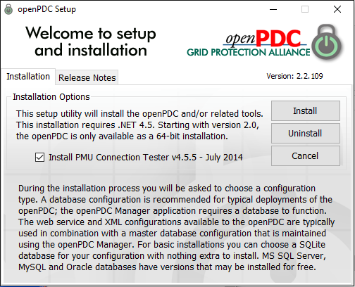

Select the installation option. In this case, we are installing openPDC v 1.42 SP2 for Windows 7 x64 bits.

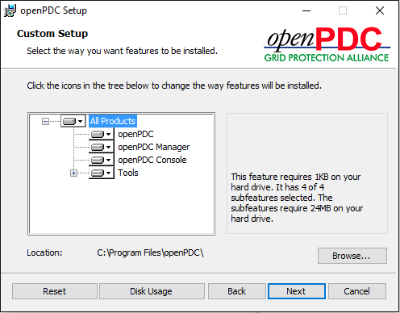

Select the options you want to install and click next. After the installation is completed, a new window for the configuration of the openPDC will pop-up.

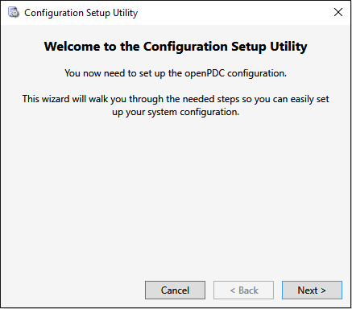

Click next in this initial configuration window.

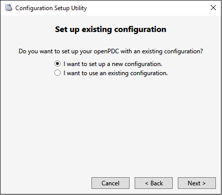

Select the option for a new configuration.

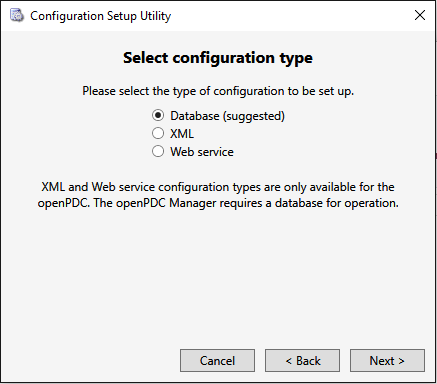

We recommend to set up a configuration based on a database (MySQL, SQL Server, etc.)

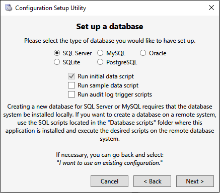

Select the database you want to use with the openPDC. In this example, we are using SQL Server. Also, select to run the data script (that will create the database) and run sample data script (that will create the sample data in the database for the openPDC to use). This last option is important if we just want to see the functionality of the openPDC with sample data. Click next.

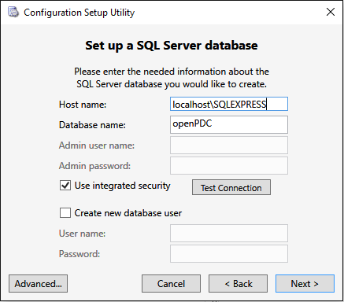

Check the Use integrated security box (in the case of SQL Server) and click on Test Connection button. The connection should be successful, otherwise, there is a problem with the configuration of the database and the openPDC will not properly work.

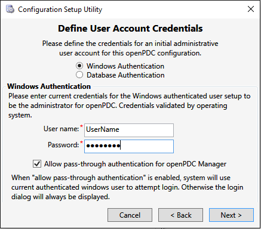

Write down your windows authentication information (user name and password) and click next.

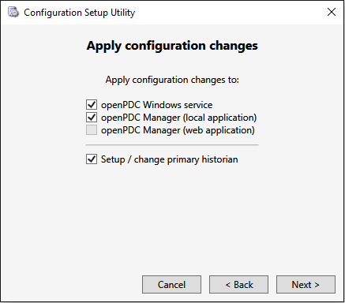

Select the components to which you want to apply the configuration changes (by default, all checked). Click next.

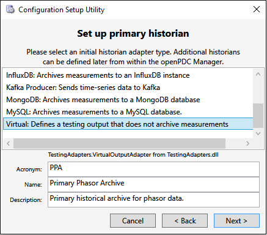

Select the primary historian. In this case, since we are using sample data, we do not need to save a history of any stream data. Therefore, we select virtual, which defines a testing output that does not save any measurements in the database. Click next two times and wait for the configuration to be completed.

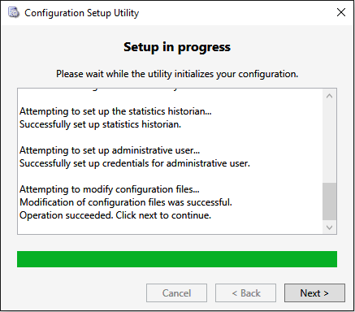

---

## Manually set up the database

The following subsections will instruct you on setting up [SQL Server](#setting-up-a-sql-server-database) and [MySQL](#setting-up-a-mysql-database) databases. You only need to set up one of these in order to run the openPDC.

### Setting up a SQL Server database

Microsoft SQL Server Express database engine and Management Studio are available for free from the Microsoft Download Center.  If Visual Studio is installed, SQL Server Express may have been installed during the Visual Studio installation.  You can also download and install SQL Server Express and Management Studio together.  Below are links to the current SQL Server 2008 R2 Express downloads.

-   [Microsoft SQL Server 2008 R2 RTM - Express](http://www.microsoft.com/downloads/en/details.aspx?FamilyID=8B3695D9-415E-41F0-A079-25AB0412424B&displayLang=en)
-   [Microsoft SQL Server 2008 R2 RTM - Management Studio Express](http://www.microsoft.com/downloads/en/details.aspx?FamilyID=56ad557c-03e6-4369-9c1d-e81b33d8026b&displayLang=en)
-   [Microsoft SQL Server 2008 R2 RTM - Express with Management Tools](http://www.microsoft.com/downloads/en/details.aspx?FamilyID=967225EB-207B-4950-91DF-EEB5F35A80EE&displayLang=en)

**Note**:  Before you execute openPDC.sql, you may want to make note that beginning on line 67 are instructions on how to modify the script to create a new user with access to the openPDC database.

1.  Launch SQL Server Management Studio Express, and connect to your database server.
2.  In the toolbar, go to "File &gt; Open &gt; File..."
3.  If you used the installers, navigate to the [installation directory](#installation-directory) and go to `Database Scripts\SQL Server`. Otherwise, navigate to `SOURCEDIR\Synchrophasor\Current Version\Source\Data\SQL Server`, select "openPDC.sql", and select "Open" (SOURCEDIR is the directory where you extracted the openPDC source code files).
4.  In the toolbar, go to "Query &gt; Execute".
5.  Repeat steps 2-4 with the files "InitialDataSet.sql" and "SampleDataSet.sql" in the same directory.

Now skip ahead to [modifying the configuration file](#modifying-the-configuration-file).

### Setting up a MySQL database

You will need to install MySQL 5.1 which is available at <http://dev.mysql.com/downloads/mysql/5.1.html#downloads>. Simply choose your operating system and follow the instructions. Additionally, Windows users who will be connecting to the database through openPDC will need to install MySQL Connector Net 6.2 which is available at <http://dev.mysql.com/downloads/connector/net/6.2.html>.
**Note**: Before you execute openPDC.sql, you may want to make note that beginning on line 17 are instructions on how to modify the script to create a new user with access to the openPDC database.

1.  Open your native command terminal.
2.  If you used the installers, navigate to the [installation directory](#installation-directory) and go to `Database Scripts\MySQL` in the command terminal. Otherwise, navigate to `SOURCEDIR\Synchrophasor\Current Version\Source\Data\MySQL` (SOURCEDIR is the directory where you extracted the openPDC source code files).
3.  Run the following command: "mysql -uroot -p &lt; openPDC.sql".
4.  Enter your root password and press "Enter".
5.  Repeat steps 3-4 with the files "InitialDataSet.sql" and "SampleDataSet.sql".

### Modifying the configuration file

The configuration file, "openPDC.exe.config" or "openPDC.config" (found in your [installation directory](#installation-directory)), is written in XML and can be opened with any text editor or with Microsoft Visual Studio 2008.

This table contains the values for the settings in the configuration file that you need to modify. Refer to the code block below to find the settings that you need to modify.

| Database | \[ConnectionString\] | \[DataProviderString\] | Notes |
|----------|----------------------|------------------------|-------|
| SQL Server | Data Source=*serverName*; Initial Catalog=openPDC; User Id=*username*; Password=*password* | AssemblyName={System.Data, Version=2.0.0.0, Culture=neutral, PublicKeyToken=b77a5c561934e089}; ConnectionType=System.Data.SqlClient.SqlConnection; AdapterType=System.Data.SqlClient.SqlDataAdapter | Replace *serverName* with the name of your database server, *username* with your username, and *password* with your password. |
| MySQL | Server=*serverName*; Database=openPDC; Uid=*username*; Pwd=*password* | AssemblyName={MySql.Data, Version=6.2.4.0, Culture=neutral, PublicKeyToken=c5687fc88969c44d}; ConnectionType=MySql.Data.MySqlClient.MySqlConnection; AdapterType=MySql.Data.MySqlClient.MySqlDataAdapter | Replace *serverName* with the name of your database server, *username* with your username, and *password* with your password. Additionally, [install MySQL Connector Net](http://dev.mysql.com/downloads/connector/net/6.2.html) if you haven't already. You may also need to modify the Version key in the data provider string depending on your version of MySQL Connector Net. |

You will need to modify the value property of the following settings using the values from the table above. Simply copy and paste the \[ConnectionString\] and \[DataProviderString\] corresponding to your database from the table.

```xml
<configuration>
  <categorizedSettings>
    <systemSettings>
      <add name="ConnectionString" value="[Connection String]" />
      <add name="DataProviderString" value="[DataProviderString]" />
    </systemSettings>
    <historianAdoMetadataProvider>
      <add name="ConnectionString" value="[ConnectionString]" />
      <add name="DataProviderString" value="[DataProviderString]" />
    </historianAdoMetadataProvider>
  </categorizedSettings>
</configuration>
```

*Note: "historian" in historianAdoMetadataProvider above will be replaced by the acronym of your local historian. If that section is not present in your configuration file, these settings will be copied from the systemSettings section the first time you run the openPDC.*

### Encrypt the configuration settings

You may have noticed that you stored your password directly in the configuration file. The openPDC allows you to encrypt configuration file settings using a tool called the ConfigCrypter which is located in the Framework solution. The following details the steps needed to encrypt configuration file settings.

1.  Build the ConfigCrypter project which is located in the Framework solution.
2.  Copy the ConfigCrypter executable (ConfigCrypter.exe) to the [openPDC installation directory](Getting_Started.md#install_directory).
3.  Run the ConfigCrypter executable in the [openPDC installation directory](Getting_Started.md#install_directory).
4.  Enter the connection string value into the text box labeled "Input".
5.  Click the link labeled "Copy to Clipboard".
6.  Open the configuration file and paste the ConfigCrypter output as the value of the ConnectionString setting.
7.  Change the "encrypted" attribute for the ConnectionString setting to <span class="codeInline">true</span>.

    The following is an example of an encrypted ConnectionString setting.

```xml
<add name="ConnectionString"
  value="Bb/ijHHcpbQi6ln/6w6SvmCtr4H2Ad51Ln26oiSo4YQpJbfxzlb8sNojupV8bK9qgIIoPP5CMjnq6CcrMFLd3k6BA1kSYC/1dWQKg499CsY="
  description="Configuration database connection string" encrypted="true" />
```

*Note: If the historianAdoMetadataProvider section is not present in your configuration file, the ConnectionString setting will be decrypted and copied from systemSettings the first time you run the openPDC. You will need to stop the openPDC, encrypt the metadata provider setting, and then restart the openPDC to ensure that your ConnectionString setting remains encrypted.*

---

## Running the openPDC

If you installed the openPDC using [the openPDC installers](#install-openpdc-with-the-installers), follow these steps.

1.  Go to "Start &gt; Run...".
2.  Type "services.msc" into the text box and click "OK".
3.  Find "openPDC" in the list, right-click it, and click "Start".

**Note**: Once the openPDC is installed, its service should be running. Therefore, this step can be skipped.

1.  If you built the project in Debug mode and want to run it using the debugger, follow these steps.
    1.  Open Microsoft Visual Studio 2008.
    2.  In the toolbar, go to "File &gt; Open &gt; Project/Solution..."
    3.  Navigate to "`SOURCEDIR\Synchrophasor\Current Version\Source`", select "Synchrophasor.sln", and select "Open" (SOURCEDIR is the directory where you extracted the openPDC source code files).
    4.  In the toolbar, go to "Debug &gt; Start Debugging".

If you built the openPDC from source, you can run it as an application by navigating to your [installation directory](#installation-directory) and double-clicking "openPDC.exe".

---

## Using the openPDC console

You can use the openPDC console to monitor the status of connections, configurations, errors, general statistics, and many other things.
If you installed the openPDC using [the openPDC installers](#install-openpdc-with-the-installers), you can run the console using the executable found in your [installation directory](#installation-directory) (and there should also be a shortcut in your Start menu). If you built it from source, the console should appear as soon as you begin running the openPDC application. Once the openPDC is ready, you can begin issuing commands through the console.

The openPDC console commands typically have three options and are entered as follows:

| Command      | Description                                            |
|--------------|--------------------------------------------------------|
| *command* /a | Executes the command on the Action Adapter Collection. |
| *command* /i | Executes the command on the Input Adapter Collection.  |
| *command* /o | Executes the command on the Output Adapter Collection. |

If you enter a command without any of the three options, it will default to the /i option. The following subsections will go over a few common uses of the system and their commands.
**Note**: Since input and output are taken care of in the same console, an output statement may appear while you're in the middle of typing a command. Please ignore this occurrence and simply continue typing the command; the program will still handle the command properly.

### See the list of commands (the help command)

The **help** command can be used to see a list of all commands that can be entered into the console.

### See the list of adapters (the list command)

Used by itself, the **list** command will simply list the adapters in the specified adapter collection. Additionally, list can display detailed information about a specific adapter specified as an argument to the command. The argument can be either the name or the ID of the adapter. The following images show examples of this usage and its output.

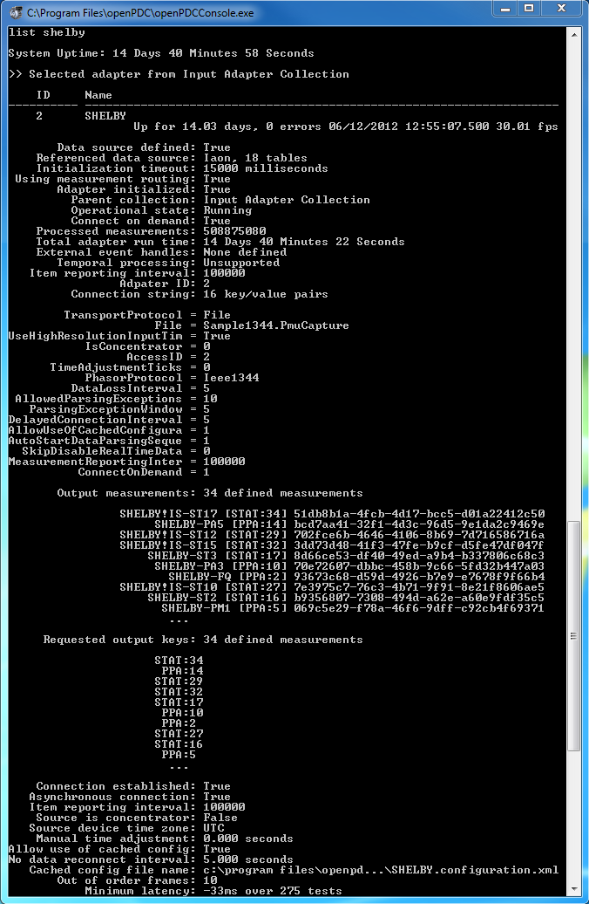

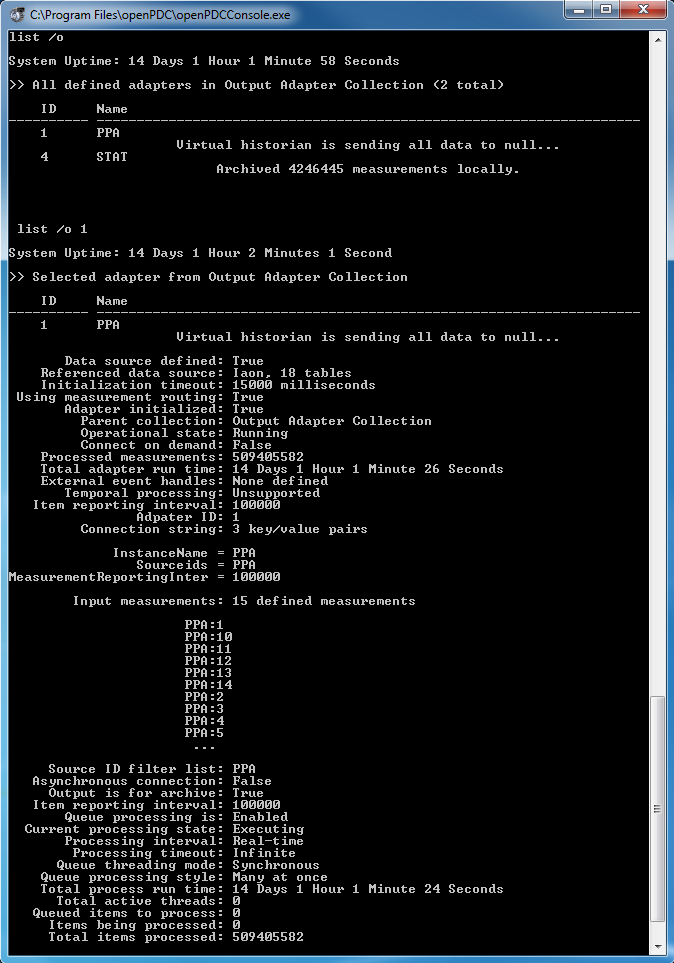

### View performance details about the openPDC service (the health command)

The **health** command lists performance details about the openPDC service allowing the viewer to see the system state and performance statistics.

### View low level data (the status command)

The **status** command outputs a significant amount of low level data about each connection. Due to the voluminous nature of this data, it is recommended that you look back to the "StatusLog.txt" file (located in the output directory `SOURCEDIR\Synchrophasor\Current Version\Build\Output\Debug\openPDC`) which saves each output seen on the screen. If you only want detailed information on a specific adapter, [the list command](#see-the-list-of-adapters-the-list-command) can be used to display only that information.

### Connect and disconnect a PMU or PDC (the connect and disconnect commands)

The **connect** and **disconnect** commands are somewhat self-explanatory. These commands are used to connect and disconnect a PMU or PDC which is available as seen in the output of the list command. The adapter can be specified by entering its name or ID as an argument to the command. The following image shows an example of the usage of these commands.

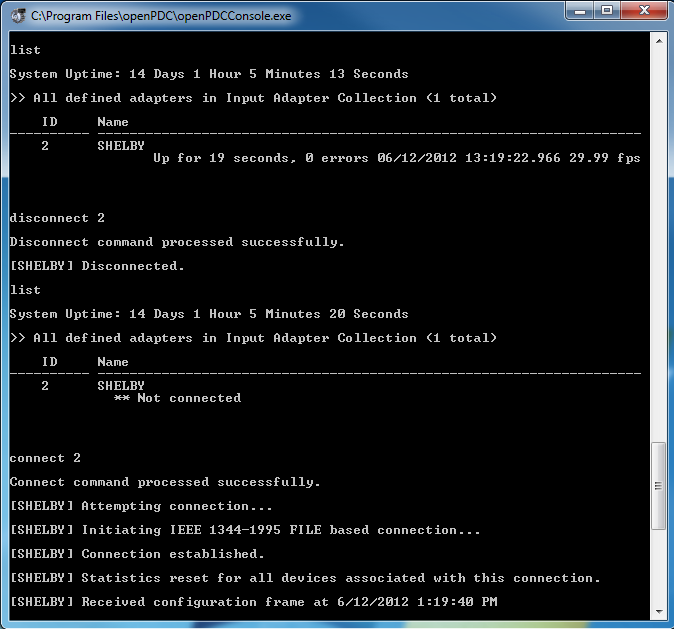

---

## Running the PMU Connection Tester

The PMU Connection Tester can be used to verify that the data stream from any known phasor measurement device is being received. 

### Install the PMU Connection Tester Software

1. Web browse to the PMU Connection Tester Release page: [PMU Connection Tester](https://github.com/GridProtectionAlliance/PMUConnectionTester/releases)
2. Scroll down to the *Downloads* section and click on the [PMUConnectionTesterSetup.zip](https://github.com/GridProtectionAlliance/PMUConnectionTester/releases/download/v4.5.6/PMUConnectionTesterSetup.zip) link to start the download.
    - When prompted, drop down the *Save* button menu and click *Save as*
    - In the *Save As* dialog, browse a desired downloads folder , then click the *Save* button.
3. Open the *Windows System / File Explorer* and navigate to the downloads folder.
2. Extract the `PMUConnectionTesterSetup.zip` contents to a new `PMUConnectionTesterSetup` folder and open the folder.
3. Run the setup wizard *PMUConnectionTesterSetup64.msi* for 64bit Windows or *PMUConnectionTesterSetup.msi* for 32bit Windows
6. Run the **PMU Connection Tester** application with its first time defaults and click the *Connect* button.


### Creating and verifying an IEEE C37.118-2005 data stream

1.  [Run openPDC](#running-the-openpdc).
2.  Go to the PMU Connection Tester window and select the "Udp" tab toward the top of the window.
3.  In the text box labeled "Local Port", enter "8800".
4.  In the drop-down list under the "Protocol" tab, select "IEEE C37.118-2005".
5.  Still under the "Protocol" tab, click "Configure alternate command channel".
6.  Clear the check box labeled "Not defined".
7.  In the text box labeled "Port", enter "8900".
8.  Click "Save".
9.  Still under the "Protocol" tab, click "Connect".

The following images show the PMU Connection Tester windows populated with the correct settings and marked with numbers corresponding to those in the steps listed above.

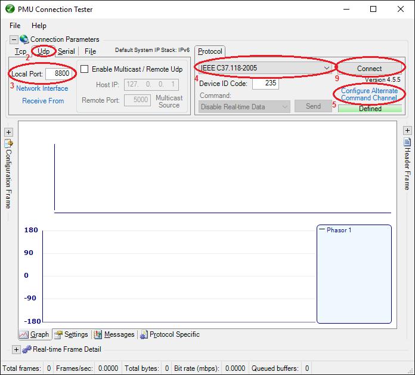

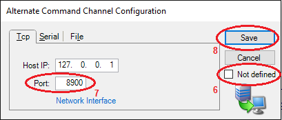

### Creating and verifying a BPA PDCstream data stream

1.  In your openPDC database, modify the "OutputStream" table.
    1.  Change the value of the "Type" column to "1".
    2.  Change the value of the "ConnectionString" column to "iniFileName=TESTSTREAM.ini".

2.  [Run openPDC](#running-the-openpdc)
3.  Go to the PMU Connection Tester window and select the "Udp" tab toward the top of the window.
4.  In the text box labeled "Local Port", enter "8800".
5.  In the drop-down list under the "Protocol" tab, select "BPA PDCstream".
6.  Select the "Extra Parameters" tab.
7.  Select the "ConfigurationFileName" property and click "..."
8.  Navigate to `SOURCEDIR\openPDC\Synchrophasor\Current Version\Build\Output\Debug\Applications\openPDC`, select TESTSTREAM.ini, and select "Open" (SOURCEDIR is the directory where you extracted the openPDC source code files).
9.  Select the "Protocol" tab.
10. Click on "Configure alternate command channel".
11. Ensure that the check box labeled "Not defined" is selected.
12. Select "Save".
13. Still under the "Protocol" tab, click "Connect".

The following images show the PMU Connection Tester windows populated with the correct settings and marked with numbers corresponding to those in the steps listed above.

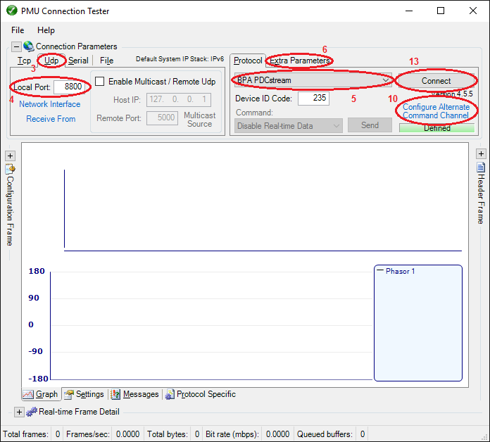

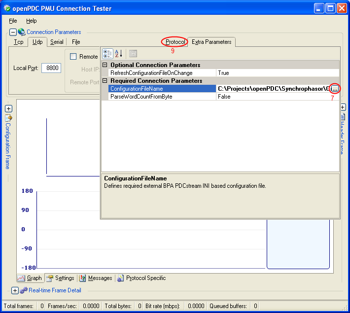

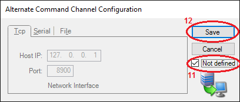

---

## Configuring openPDC security

In the latest version, security is enabled by default. See [Remote Console Security](Remote_Console_Security.md) for more information.

---

## Using the in-process historian adapter

The in-process historian adapter optionally allows for the metadata and the time-series data stored in the local archive to be accessed via REST web services. The openPDC by default has both the metadata and time-series web services enabled, and they can be accessed at `http://localhost:6151/historian` and `http://localhost:6152/historian` URLs respectively. See below for a brief description of the REST API for these web services:

**Note**: The format in which data is returned by these web services depend on the format specified at the end of all the URLs below. The formats currently supported by these web services are XML and JSON.

### Metadata Web Service

- `http://localhost:6151/historian/metadata/read/[xml|json]`
Returns metadata for all of the measurements defined in the archive.
- `http://localhost:6151/historian/metadata/read/<one or more ID delimited by comma>/[xml|json]`
Returns metadata for the measurement IDs specified in the comma-delimited list.
- `http://localhost:6151/historian/metadata/read/<starting ID in the range>-<ending ID in the range>/[xml|json]`
Returns metadata for all the measurement IDs specified in the range.

### Time-series Web Service

- `http://localhost:6152/historian/timeseriesdata/read/current/<one or more ID delimited by comma>/[xml|json]`
Returns the latest time-series data for the measurement IDs specified in the comma-delimited list.
- `http://localhost:6152/historian/timeseriesdata/read/current/<starting ID in the range>-<ending ID in the range>/[xml|json]`
Returns the latest time-series data for the measurement IDs specified in the range.
- `http://localhost:6152/historian/timeseriesdata/read/historic/<one or more ID delimited by comma>/<start time>/<end time>/[xml|json]`
Returns historic time series data for the measurement IDs specified in the comma-delimited list for the specified GMT time span. The time can be absolute time (Example: 09-21-09 23:00:01 for Sep 21, 09 11:00:01 pm) or relative to the current time (Example: \* for now or \*-1m for 1 minute ago where s = seconds, m = minutes, h = hours and d = days).
- `http://localhost:6152/historian/timeseriesdata/read/historic/<starting ID in the range>-<ending ID in the range>/<start time>/<end time>/[xml|json]`
Returns historic time series data for the measurement IDs specified in the range for the specified GMT time span (time format is same as above).

---

## Configuring a Connection String

This section contains information about how to configure the connection string for the MultiProtocolFrameParser. The connection string can be found on lines 29-31 of the code snippet from the [Device to Data in 5 easy steps](Developers_Device_to_Data.md) page and also in the Device table of the openPDC database. The first step to configuring your connection string is to determine which transport protocol you're using and change the value of the transportProtocol key accordingly. The following subsections detail the keys that are specific to each transport protocol. The possible values for the transportProtocol key are [file](#file), [tcp](#tcp), [udp](#udp), and [serial](#serial).

### File

**Note**: The connection string is already configured for the file transport protocol in the [example code snippet](Developers_Device_to_Data.md#step3).

The **file** key specifies the name of the file from which phasor measurements are read.  The following is an example connection string using the file transport protocol:

- `phasorProtocol=Ieee1344; accessID=2; transportProtocol=file; file=Sample1344.PmuCapture`

### TCP

The **server** key specifies the name or IP address of the device and the port on which it is listening (localhost:8888 or 127.0.0.1:8888 format).

The *interface* key is optional and specifies the interface through which the TCP connection is being made.  The following is an example connection string using the TCP transport protocol:

- `phasorProtocol=IeeeC37_118V1; accessID=5; transportProtocol=tcp; server=localhost:8888`

### UDP

The **port** key specifies which UDP port the device is broadcasting to.

The *interface* key is optional and specifies the interface through which the UDP connection is being made.

The *server* key is optional and is used to broadcast data over a UDP connection.

The following is an example connection string using the UDP transport protocol:

- `phasorProtocol=BpaPdcStream; iniFileName=TestConfig.ini; transportProtocol=udp; port=8500`

### Serial

The **port** key can be entered as "COM1", "COM2", etc.

The **baudrate** key is an integer.

The **parity** key should be entered as one of the following: None, Odd, Even, Mark, Space.

The **stopbits** key should be entered as one of the following: None, One, Two, OnePointFive.

The **databits** key is an integer.

The *dtrenable* key is is an optional boolean value that enables the Data Terminal Ready (DTR) signal.

The *rtsenable* key is an optional boolean value that enables the Request to Send (RTS) signal.

The following is an example connection string using the serial transport protocol:

- `phasorProtocol=SelFastMessage; transportProtocol=serial; port=COM1; baudrate=57600; parity=None; stopbits=One; databits=8`

---

## Installation directory

If you installed the openPDC using [the openPDC installers](#install-openpdc-with-the-installers) the default installation directory can be found at the following location.

- `\Program Files\openPDC`

If you built the openPDC from source, the output directory is in one of two places (depending on whether you built the system in Release mode or Debug mode respectively).

- `SOURCEDIR\Synchrophasor\Current Version\Build\Output\Release\Applications\openPDC`
- `SOURCEDIR\Synchrophasor\Current Version\Build\Output\Debug\Applications\openPDC`

Where SOURCEDIR is the directory where you extracted the openPDC source code.

---

Dec 20, 2016 - Updated

---

Copyright 2016 [Grid Protection Alliance](http://www.gridprotectionalliance.org)
